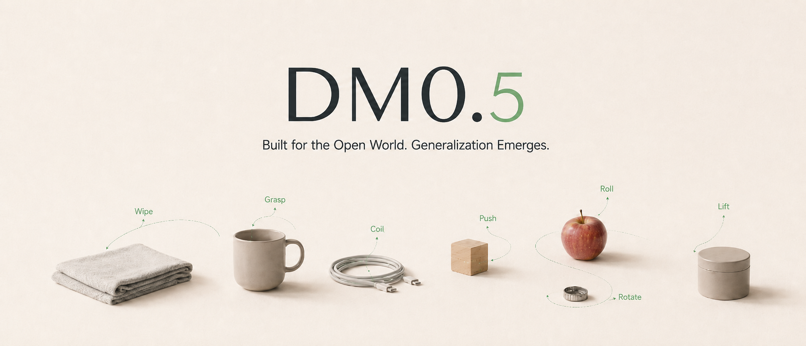

# OpenDM



<p align="center">
  <a href="https://www.dexmal.com/blog/dm0.5/index_en.html"></a>
  <a href="https://huggingface.co/Dexmal/models"></a>
  <a href="https://maas.dexmal.com/"></a>
  <a href="#license"></a>
</p>

<p align="center">
  English | <a href="README.zh-CN.md">简体中文</a>
</p>

## Introduction

DM0.5 is Dexmal's next-generation Vision-Language-Action model (VLA) for open-world robot control. It builds on the native embodied modeling approach introduced by DM0, with systematic upgrades for open-ended instructions, long-horizon tasks, dynamic disturbances, and multi-embodiment robot control.

OpenDM provides DM0.5 model weights, training and inference scripts, dataset registration examples, and evaluation workflows for researchers and developers to train, fine-tune, evaluate, and deploy the model.

## News

- [2026-07-09] DM0.5 is officially released. Read the [technical blog](https://www.dexmal.com/blog/dm0.5/index_en.html) for more details.

## Models

| Model | Description | Checkpoint |
| --- | --- | --- |
| DM05 | Base DM0.5 model for fine-tuning | [🤗 Dexmal/DM05](https://huggingface.co/Dexmal/DM05) |
| DM05-libero | LIBERO fine-tuned DM0.5 model for evaluation | [🤗 Dexmal/DM05-libero](https://huggingface.co/Dexmal/DM05-libero) |

Example checkpoint download:

```bash
huggingface-cli download Dexmal/DM05 --local-dir ./checkpoints/DM05
```

## Quick Start

We recommend using Docker to set up the runtime environment first, which helps avoid version mismatches across CUDA, PyTorch, flash-attn, and other dependencies on the host machine.

### Requirements

```text
System requirements:
Ubuntu 20.04 / 22.04
NVIDIA GPU
NVIDIA Driver
Docker
NVIDIA Container Toolkit
Conda (optional, only required for local pip installation)

Recommended GPUs:
RTX 4090, A100, H100, H20
8 GPUs are recommended for training, and 1 GPU is sufficient for deployment inference.
```

### Docker Installation

```bash
git clone https://github.com/dexmal/opendm.git

docker run -it --rm --gpus all --ipc=host --shm-size=16g --network host \
  --name opendm \
  -v $(pwd)/opendm:/app/opendm \
  opendm:latest /bin/bash

# Run from the OpenDM repository root.
conda activate opendm
pip install -e .
```

### Local Installation

```bash
conda create -n opendm python=3.10 -y
conda activate opendm

pip install torch torchvision \
  --index-url https://download.pytorch.org/whl/cu128 \
  --extra-index-url https://mirrors.ivolces.com/pypi/simple/

pip install ninja packaging
MAX_JOBS=2 pip install flash-attn --no-build-isolation

# Run from the OpenDM repository root.
cd opendm
pip install -e .
```

## Inference

After installing the environment and initializing the source code, you can start the model inference service. The service loads the specified checkpoint and exposes an HTTP endpoint for benchmark clients or other applications to request action predictions.

```bash
script/dm05_launcher.sh \
  --task inference \
  --nproc_per_node 1 \
  --model-config.model-name-or-path ./checkpoints/DM05 \
  --model-config.chunk-size 10 \
  --inference-config.port 7891
```

Arguments:

- `--task`: task type. Use `inference` for inference.
- `--nproc_per_node`: number of GPUs on a single node. 1 GPU is sufficient for inference.
- `--model-config.model-name-or-path`: model checkpoint path.
- `--model-config.chunk-size`: action chunk length.
- `--inference-config.port`: inference service port.

During inference, the service looks for `norm_stats.json` in the checkpoint directory.

After the service starts, send a test request to verify that the endpoint returns a valid response:

```bash
bash tests/curl_demo.sh http://SERVER_IP:7891/process_frame
```

A successful response has the following shape.

```text
{
  "response": [
    [0.012, -0.034, 0.18, "..."],
    [0.015, -0.031, 0.17, "..."],
    ...
  ]
}
```

## Training

### Data Preparation

Prepare data files and dataset configuration according to the dexbotic [Data Guide](https://github.com/dexmal/dexbotic/blob/main/docs/Data.md). Make sure `--data-config.dataset-name` in the training command matches the registered dataset name.

The training script selects a dataset through `--data-config.dataset-name`. Before training, register your dataset in the project dataset registry. We recommend using an existing file such as `opendm/dataset/demo.py` as a reference, then creating a new dataset config file such as `opendm/dataset/my_robot.py` and updating the dataset name, data paths, image keys, and state description.

```python
# opendm/dataset/my_robot.py

from opendm.constants.robot import RobotStateDesc
from opendm.dataset.register import register_dataset

MY_ROBOT_STATE_DESC = (
    [RobotStateDesc.JOINT] * 6
    + [RobotStateDesc.GRIPPER]
    + [RobotStateDesc.JOINT] * 6
    + [RobotStateDesc.GRIPPER]
)

register_dataset(
    {
        "my_robot": {
            "jsonl_dir": "./assets/my_robot/",
            "image_dir": "./assets/my_robot/",
            "image_keys": ["images_1", "images_2", "images_3"],
            "state_desc": MY_ROBOT_STATE_DESC,
        },
    }
)
```

Field descriptions:

- `my_robot`: dataset name registered in the dataset registry. Use it with `--data-config.dataset-name my_robot`.
- `jsonl_dir`: directory containing training `jsonl` files.
- `image_dir`: directory containing image files.
- `image_keys`: image field names to load from the dataset.
- `state_desc`: semantic description of each state/action dimension, such as robot joints and grippers.

During training, if the corresponding normalization statistics file does not exist, the script automatically computes it from the current dataset, action mode, and chunk size, then saves it under `./norm_stats/`.

### Start Training

After environment setup, source initialization, and data preparation, start model training. The training script reads the specified dataset configuration, loads the base checkpoint, and starts training according to the configuration.

```bash
script/dm05_launcher.sh \
  --task train \
  --nproc_per_node 8 \
  --data-config.dataset-name my_robot \
  --model-config.model-name-or-path ./checkpoints/DM05 \
  --model-config.chunk-size 10
```

Arguments:

- `--task train`: run in training mode.
- `--nproc_per_node 8`: number of training processes on a single node, usually matching the number of GPUs.
- `--data-config.dataset-name my_robot`: dataset name for training. It must match the project dataset configuration.
- `--model-config.model-name-or-path ./checkpoints/DM05`: initial model checkpoint path.
- `--model-config.chunk-size 10`: action chunk length predicted by the model.

Training logs will include data loading, model initialization, loss values, and checkpoint saving. Before running a full training job, verify that the data path, model checkpoint path, and GPU count are correctly configured.

## LIBERO Fine-Tuning Reference

Use the [LIBERO Training and Evaluation Guide](docs/en/libero.md) as an end-to-end reference for fine-tuning DM05. It covers data and model preparation, SFT training, inference service startup, and benchmark evaluation, and can help you adapt DM05 to your own robot datasets.

## Guides

- Download models: see [Models](#models) or visit [Dexmal Hugging Face](https://huggingface.co/Dexmal).
- Prepare data: see the [Data Guide](https://github.com/dexmal/dexbotic/blob/main/docs/Data.md).
- Start inference service: see [Inference](#inference).
- Fine-tune on custom data: see [Training](#training).
- LIBERO training and evaluation: see the [LIBERO Training and Evaluation Guide](docs/en/libero.md); for LoRA SFT, see [DM05 LIBERO LoRA Training](docs/en/dm05_libero_lora_training.md).

## Community and Support

- Learn more about Dexmal products and model updates on the [Dexmal website](https://www.dexmal.com/).
- Get DM model weights from [Dexmal Hugging Face](https://huggingface.co/Dexmal).
- If you encounter issues, please report them through [GitHub Issues](https://github.com/dexmal/opendm/issues).
- For further discussion, scan the [WeChat QR code](docs/image/wechat.jpeg) to contact us.

We will continue to release more model weights, technical documentation, and examples. If this project is helpful to you, please consider giving us a star on GitHub [](https://github.com/dexmal/opendm). Your support helps us move forward.

## License

This project is licensed under the [Apache-2.0](LICENSE).
